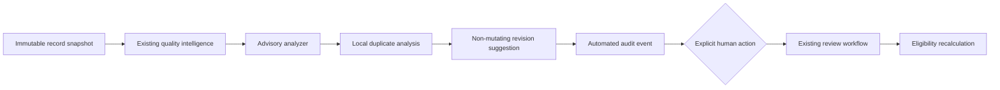

# AI-assisted review architecture

This staged design extends the existing GaiaLab registry rather than creating a
competing review system.

## Boundaries

- `src.review_automation.models` defines strictly validated advisory,
  suggestion, duplicate-match, and separate AI/human audit envelopes.
- `src.review_automation.config` validates queue, risk, threshold, retry,
  timeout, provider, and domain-review settings.
- The default provider is local and deterministic. External providers require
  explicit opt-in; secret values are not represented by the configuration model.
- Recommendation categories end in `_candidate` or explicitly request
  escalation. None is an official `approved` or `rejected` status.
- Suggested revisions carry text and impact explanations but cannot mutate a
  source record. Human acceptance routes through the existing
  `create_revision` function and produces a linked draft child revision.
- Automated and human audit event types are distinct models so an AI event
  cannot be interpreted as a human decision.

The versioned prompt lives in `evaluation/review_prompts/`, outside Streamlit.
Stage 2 adds the deterministic queue, duplicate analysis, provider abstraction,
advisory analyzer, write-once reports, CLI, and daily work packs. Stage 3 adds
separate immutable automated and human audit logs, confirmation-gated human
decisions, child-revision handling, write-once downstream refresh reports, and
the **AI-Assisted Review** Streamlit page.

Escalation is recorded as the explicit human action `escalate` while the
existing official status transitions to `needs_revision`. This preserves the
repository's governed status schema. Approval still requires the existing
technical and, where applicable, domain-review transitions plus an explicit
confirmation checkbox. Release creation and publication remain separate.
