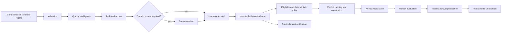

# System overview

GaiaLab is a local-first, file-backed governance platform. Its append-only
dataset registry feeds advisory quality checks and explicit human review.
Immutable releases feed eligibility, deterministic splitting, offline export,
and verification. A separate write-once model registry links training inputs,
scripts, artifacts, evaluation reports, and model releases.

Automated systems never approve records, run training, or publish externally.
